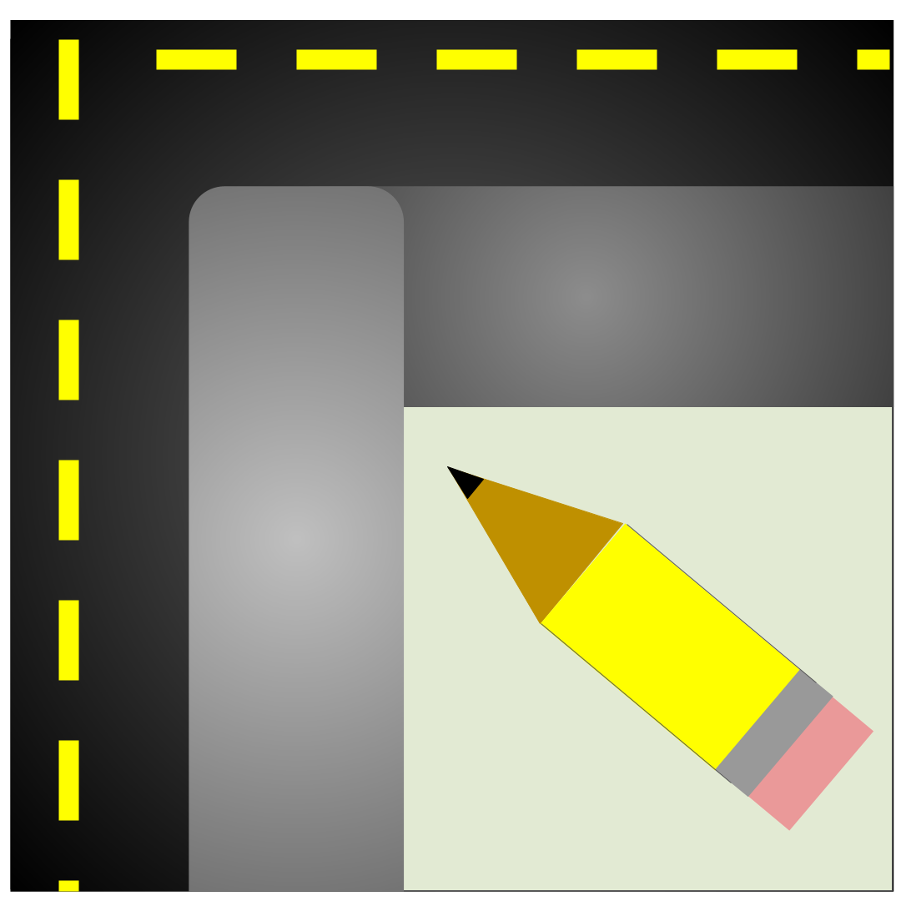

[](https://github.com/kauevestena/osm_sidewalkreator/actions/workflows/smoke.yml)

# OSM Sidewalkreator

A QGIS plugin to automatically generate sidewalk networks from OpenStreetMap streets. Available in the official QGIS Plugin Repository: https://plugins.qgis.org/plugins/osm_sidewalkreator/



## Overview

- Generate sidewalk lines, crossings, and kerb points from OSM roads.
- Use interactively in QGIS or headlessly via Processing/CLI.
- Package releases and run tests locally or in Docker.
- Requires QGIS 3.44+.

## What’s New

Recent updates introduce a Processing provider and headless tooling that make it easier to automate and test the full pipeline:

- Processing provider: four algorithms under the “SidewalKreator” toolbox group
  - `generateprotoblocksfromosm` — protoblocks from polygon input
  - `generateprotoblocksfrombbox` — protoblocks from BBOX extent
  - `fullsidewalkreatorfrompolygon` — full pipeline from polygon (sidewalks, crossings, kerbs)
  - `osm_sidewalkreator_full_bbox` — full pipeline from BBOX extent
- Headless runners in `docker/` for bbox/polygon inputs (no local QGIS install required)
- CI-friendly QGIS tests via `scripts/run_qgis_tests.sh` and quick local tests via `pytest -m 'not qgis'`
- Release packaging with `release/release_zip.py`

## Features

- Sidewalk generation from OSM highways with configurable widths and classes
- Optional building/address data fetch for improved geometry and segment splits
- Crossing line creation and kerb point extraction at intersections
- Export to JOSM‑ready GeoJSON for OSM editing

## Quick Start (QGIS)

1. Install the plugin: search for “OSM SidewalKreator” in QGIS Plugin Manager
2. Prepare AOI: add a polygon layer for your area of interest
3. Run: open Processing > SidewalKreator, pick a polygon or BBOX, choose outputs
4. Export: view layers and export to your preferred format

Tutorials:

- Basics: https://www.youtube.com/watch?v=jq-K3Ixx0IM
- First import to JOSM: https://www.youtube.com/watch?v=Apqdb73lNvY

## Processing / Headless Usage

Provider id: `sidewalkreator_algorithms_provider`. A helper executes Processing inside Docker so you don’t need a local QGIS:

```bash
# From source tree
./scripts/run_qgis_processing.sh generateprotoblocksfromosm INPUT=/path/to/polygon.gpkg OUTPUT=/tmp/protoblocks.gpkg

# From a packaged release
./scripts/run_qgis_processing.sh --use-release generateprotoblocksfromosm INPUT=/path/to/polygon.gpkg OUTPUT=/tmp/protoblocks.gpkg
```

Examples with full pipeline:

```bash
# Full network from polygon (sidewalks, crossings, kerbs)
./scripts/run_qgis_processing.sh fullsidewalkreatorfrompolygon \
  INPUT_POLYGON=/path/to/aoi.gpkg \
  OUTPUT_SIDEWALKS=/tmp/sidewalks.geojson \
  OUTPUT_CROSSINGS=/tmp/crossings.geojson \
  OUTPUT_KERBS=/tmp/kerbs.geojson

# Full network from BBOX extent (EPSG:4326)
./scripts/run_qgis_processing.sh osm_sidewalkreator_full_bbox \
  INPUT_EXTENT="-49.3,-25.5,-49.29,-25.45" \
  OUTPUT_SIDEWALKS=/tmp/sidewalks.geojson
```

Headless runners (simpler Docker scripts) are also available — see `docker/README.md`:

- `docker/run_full_bbox.sh`, `docker/run_full_polygon.sh`
- `docker/run_protoblocks_bbox.sh`, `docker/run_protoblocks_polygon.sh`

Notes:

- BBOX coordinates are in EPSG:4326
- Scripts create outputs under `assets/test_outputs/` by default (overridable)

## Testing

Quick local tests (no QGIS):

```bash
pip install -r docker/requirements.txt
pytest -m "not qgis"
```

Full test suite in Docker/QGIS:

```bash
./scripts/run_qgis_tests.sh
```

Optionally build a helper image:

```bash
docker build -f docker/Dockerfile -t my-org/qgis-test:latest .
```

Test data lives under `assets/test_data/`. To refresh the small OSM extract used by tests:

```bash
curl -L "https://overpass-api.de/api/map?bbox=-49.248337,-25.491146,-49.239228,-25.486957" -o test/data/curitiba_sample.osm
```

## Releases

Create a plugin zip (written under `~/sidewalkreator_release` by default):

```bash
python release/release_zip.py
```

Customize inputs/outputs/excludes:

```bash
python release/release_zip.py --plugin-dir /path/to/plugin \
  --output-dir /tmp/build --exclude tests docs "*.pyc"
```

## References

- QGIS Plugin page: https://plugins.qgis.org/plugins/osm_sidewalkreator/
- OSM Wiki: https://wiki.openstreetmap.org/wiki/OSM_SidewalKreator
- State of the Map 2022: slides https://rebrand.ly/kauevestena_sotm22 • video https://www.youtube.com/watch?v=B--1ge42UHY • abstract https://zenodo.org/record/7004523

## Publication

European Journal of Geography (12/12/2023): https://eurogeojournal.eu/index.php/egj/article/view/553

de Moraes Vestena, Kauê, Silvana Philippi Camboim, and Daniel Rodrigues dos Santos. 2023. “OSM Sidewalkreator: A QGIS Plugin for an Automated Drawing of Sidewalk Networks for OpenStreetMap”. European Journal of Geography 14 (4):66–84. https://doi.org/10.48088/ejg.k.ves.14.4.066.084

Experiments repository: https://github.com/kauevestena/sidewalk_analysis

