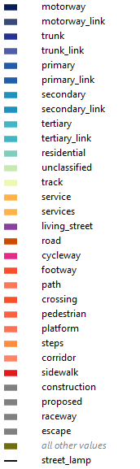

This is for the style of the objects with the "higway" key, used as base to drawn the geometries.

Basic used colorschemas were this two (both from the amazing Colorbrewer 2.0):

https://colorbrewer2.org/#type=sequential&scheme=YlGnBu&n=9 (For car roads)
https://colorbrewer2.org/#type=sequential&scheme=YlOrRd&n=9 (For footways)

https://colorbrewer2.org/#type=sequential&scheme=RdPu&n=9 (just the pink for cycleways)

depiction of current color schema (someday it will be prettier and better organized):

Ruleset:

- Car roads: YlGnBu scale, links with 80% transparency
- Footways: YlOrRd scale, but centered on red for footwats
- Living streets as purple, the "mix of car roads and footways"
- highway=road: brown, since it could be anything 
- Service roads: light orange from YlOrRd
- Cycleways: Pink
- Construction/planned: dashed grays
- Irrelevant ones: gray
- Other values: a strange "olive", since we don't know anything in advance
- Wrong values: white, since surely they must had other values